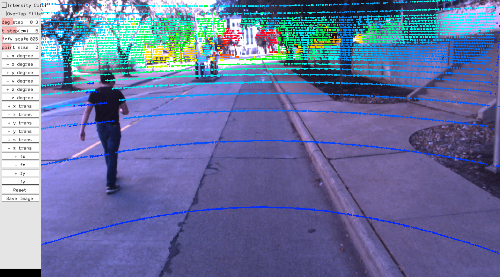

## Introduction

This is LiDAR to camera calibration by following the SensorsCalibration toolbox from https://github.com/PJLab-ADG/SensorsCalibration.

## Prerequisites

- Cmake
- opencv 2.4
- eigen 3
- PCL 1.9
- Pangolin

## Compile
Compile the manual_calib folder

```shell
# mkdir build
mkdir -p build && cd build
# build
cmake .. && make
```

## Manual calibration tool

1. Four input files: 

   ```
   Usage: ./run_lidar2camera <image_path> <pcd_path> <intrinsic_json> <extrinsic_json>
   ```
+ **image_path:** image file from the Camera sensor
+ **pcd_path:** PCD file from the Lidar sensor
+ **intrinsic_json:** Camera intrinsic parameter JSON file
+ **extrinsic_json:** JSON file of initial values of extrinsic parameters between sensors
</br>


2. Run the example:

   The executable file is under the bin folder.

   ```
   cd ~./manual_calib/
   ./bin/run_lidar2camera data/0001.png data/0001.pcd data/middle_camera-intrinsic.json data/top_center_lidar-to-middle_camera-extrinsic.json
   ```

3. Calibration panel:

   <br>

   The calibration window consists of the left control panel for manual calibration and the right point cloud projection image. Users can check whether the points cloud and the image are aligned by clicking the corresponding button in the panel or using Keyboard as input to adjust the extrinsic parameter. When the points cloud and the image are aligned, the calibration ends, click the save button to save the result.  

   | Extrinsic Params | Keyboard_input | Extrinsic Params | Keyboard_input |
   | :--------------: | :------------: | :--------------: | :------------: |
   |    +x degree     |       q        |    -x degree     |       a        |
   |    +y degree     |       w        |    -y degree     |       s        |
   |    +z degree     |       e        |    -z degree     |       d        |
   |     +x trans     |       r        |     -x trans     |       f        |
   |     +y trans     |       t        |     -y trans     |       g        |
   |     +z trans     |       y        |     -z trans     |       h        |

   | Intrinsic Params | Keyboard_input | Intrinsic Params | Keyboard_input |
   | :--------------: | :------------: | :--------------: | :------------: |
   |       + fy       |       i        |       - fy       |       k        |
   |       + fx       |       u        |       - fx       |       j        |

   ```Intensity Color```: LiDAR intensity is recorded as the return strength of a laser beam, partly based on the reflectivity of the object struck by the laser pulse. This button can change the display mode to intensity map display mode. This can help to check if the ground lane lines are aligned.

   ```	Overlap Filter```: Eliminate overlap Lidar points within a depth of 0.4m. 

   ``deg step`` ``t step `` ``fxfy scale`` : These three buttons change the adjustment step for every click or keyboard input.

   ``point size``: Adjust the size of Lidar points in the projection image.

   ``Reset``:  Press button to reset all manual adjustment.

   ``Save Image``:  If the this button was pressed, the results (calibrated image,  extrinsic and intrinsic matrix) are stored by default at running directory `~./manual_calib/`:

   ```
   Extrinsic:
   R:
   -0.0338834 -0.999426 -0.000574291
   -0.499573 0.0174347 -0.866096
    0.865609 -0.0290594 -0.499877
   t: -0.147759 0.0684198 -0.156651

   Intrinsic:
   913.046 0 777.116
   0 911.731 581.65
   0 0 1
   ************* json format *************
   Extrinsic:
   [-0.0338834,-0.999426,-0.000574291,-0.147759],[-0.499573,0.0174347,-0.866096,0.0684198],[0.865609,-0.0290594,-0.499877,-0.156651],[0,0,0,1]

   Intrinsic:
   [913.046,0,777.116],[0,911.731,581.65],[0,0,1]

   Distortion:
   [-0.224177,0.0637302,0.000168083,6.04256e-05]
   
   ```
   Note: This result can be improved further by adjusting the panel. 

## Automatic calibration tool (To Be Added)

## Citation
This code is based on the research below:
```
@misc{2103.04558,
Author = {Tao Ma and Zhizheng Liu and Guohang Yan and Yikang Li},
Title = {CRLF: Automatic Calibration and Refinement based on Line Feature for LiDAR and Camera in Road Scenes},
Year = {2021},
Eprint = {arXiv:2103.04558},
}
   
```
